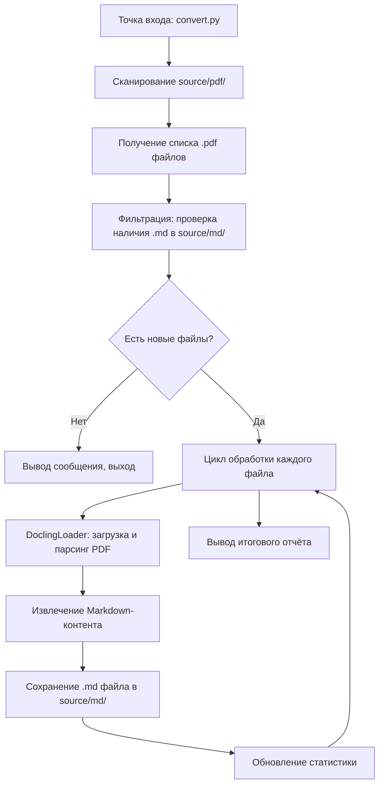

# Design Document: PDF to Markdown Conversion

## Overview

Скрипт конвертации PDF-файлов в Markdown реализуется как однофайловый Python-модуль, использующий `langchain-docling` для извлечения структурированного содержимого из PDF. Скрипт сканирует директорию `source/pdf/`, определяет какие файлы ещё не сконвертированы (инкрементальная обработка), конвертирует новые PDF через `DoclingLoader` с экспортом в формат Markdown, и сохраняет результат в `source/md/`.

Управление зависимостями осуществляется через `uv`. Проект включает README.md с инструкциями по установке и запуску.

## Architecture



### Архитектурные решения

1. **Два файла: `config.py` + `convert.py`** — конфигурация (пути, расширения) вынесена в отдельный файл `config.py`, логика конвертации — в `convert.py`.
2. **ExportType.MARKDOWN** — используем режим экспорта целого документа (не чанков), так как задача — получить полный Markdown-файл для каждого PDF.
3. **Последовательная обработка** — файлы обрабатываются по одному. Для 3 PDF-файлов параллелизм не нужен.
4. **Инкрементальность по имени файла** — простая проверка наличия `.md` файла с тем же базовым именем. Не проверяем дату модификации.

## Components and Interfaces

### Компонент 1: File Discovery (обнаружение файлов)

**Функция:** `discover_pdf_files(source_dir: Path) -> list[Path]`

- Сканирует `source_dir` на наличие файлов с расширением `.pdf`
- Возвращает отсортированный список путей к PDF-файлам
- Выбрасывает `FileNotFoundError` если директория не существует

### Компонент 2: Incremental Filter (фильтр инкрементальной обработки)

**Функция:** `filter_unconverted(pdf_files: list[Path], output_dir: Path) -> tuple[list[Path], list[Path]]`

- Принимает список PDF-файлов и путь к output-директории
- Возвращает кортеж: (файлы для конвертации, пропущенные файлы)
- Сравнивает базовые имена: `file.pdf` → проверяет существование `file.md`

### Компонент 3: PDF Converter (конвертер)

**Функция:** `convert_pdf_to_markdown(pdf_path: Path) -> str`

- Использует `DoclingLoader` с `export_type=ExportType.MARKDOWN`
- Загружает один PDF-файл и возвращает его содержимое в формате Markdown
- Выбрасывает исключение при ошибке парсинга

### Компонент 4: File Writer (запись файлов)

**Функция:** `save_markdown(content: str, output_path: Path) -> None`

- Создаёт выходную директорию если она не существует (`mkdir -p`)
- Записывает Markdown-контент в файл с кодировкой UTF-8

### Компонент 5: Main Orchestrator (оркестратор)

**Функция:** `main() -> None`

- Координирует все компоненты
- Управляет выводом прогресса и итогового отчёта
- Обрабатывает ошибки отдельных файлов без остановки всего процесса

### Внешние зависимости

| Пакет | Назначение |
|-------|-----------|
| `langchain-docling` | Интеграция Docling с LangChain, предоставляет `DoclingLoader` |
| `docling` | Ядро для парсинга PDF (устанавливается как зависимость langchain-docling) |

## Data Models

### Модель статистики выполнения

```python
@dataclass
class ConversionStats:
    total_found: int = 0      # Всего PDF найдено
    skipped: int = 0          # Пропущено (уже сконвертированы)
    converted: int = 0        # Успешно сконвертировано
    failed: int = 0           # Ошибки конвертации
    errors: list[str] = field(default_factory=list)  # Описания ошибок
```

### Константы конфигурации (файл `config.py`)

```python
from pathlib import Path

SOURCE_DIR = Path("source/pdf")
OUTPUT_DIR = Path("source/md")
IMAGES_DIR = Path("source/md/img")
PDF_EXTENSION = ".pdf"
MD_EXTENSION = ".md"
```

`convert.py` импортирует константы из `config.py`:
```python
from config import SOURCE_DIR, OUTPUT_DIR, IMAGES_DIR, PDF_EXTENSION, MD_EXTENSION
```

### Использование DoclingLoader

```python
from langchain_docling import DoclingLoader
from langchain_docling.loader import ExportType

loader = DoclingLoader(
    file_path=str(pdf_path),
    export_type=ExportType.MARKDOWN,
)
documents = loader.load()
# documents[0].page_content содержит Markdown-текст
```


## Error Handling

### Стратегия обработки ошибок

Скрипт следует принципу **"fail gracefully per file, report at the end"**:

| Ситуация | Поведение |
|----------|----------|
| Source_Directory не существует | `FileNotFoundError` с описательным сообщением, скрипт завершается с кодом 1 |
| Нет PDF-файлов в директории | Предупреждение в stdout, скрипт завершается с кодом 0 |
| Ошибка парсинга конкретного PDF | Ошибка логируется, файл считается failed, обработка продолжается |
| Ошибка записи .md файла | Ошибка логируется, файл считается failed, обработка продолжается |
| Output_Directory не существует | Создаётся автоматически через `Path.mkdir(parents=True, exist_ok=True)` |

### Примеры сообщений об ошибках

```
ERROR: Source directory 'source/pdf/' does not exist.
WARNING: No PDF files found in 'source/pdf/'.
ERROR: Failed to convert '01_arctic_gold_2017.pdf': <exception message>
ERROR: Failed to write 'source/md/01_arctic_gold_2017.md': <exception message>
```


