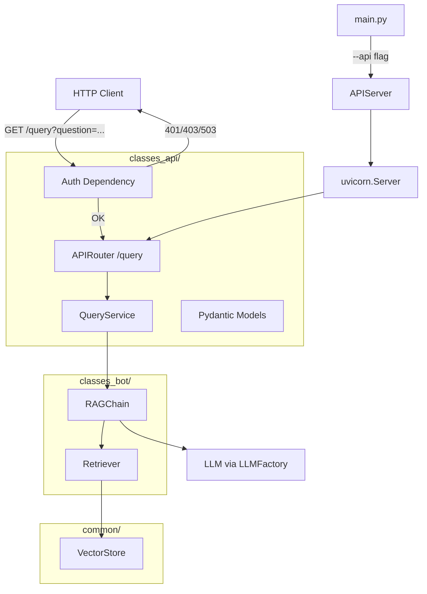

# Technical Design: REST API

## Overview

REST API для RAG-системы, реализованный на FastAPI. Предоставляет HTTP-эндпоинт `/query` для получения ответов из RAG-пайплайна. Аутентификация через Bearer-токен (API_KEY). Запуск интегрирован в CLI через флаг `--api`. Архитектура повторяет паттерны существующего Telegram-бота: lazy imports, сигналы для graceful shutdown, переиспользование RAGChain.

Ключевые решения:
- Отдельный модуль `classes_api/` по аналогии с `classes_bot/`
- Сервисный слой отделяет бизнес-логику от HTTP-обработчиков
- FastAPI dependency injection для аутентификации и доступа к RAGChain
- Uvicorn как ASGI-сервер (программный запуск через `uvicorn.Server`)
- PID-файлы для отслеживания процессов

## Architecture



### Поток запроса

1. Клиент отправляет `GET /query?question=текст` с заголовком `Authorization: Bearer <token>`
2. Dependency `verify_api_key` проверяет токен: 503 если API_KEY не задан, 401 если заголовок отсутствует, 403 если токен не совпадает
3. Dependency `QueryParams` валидирует query-параметры: 422 если question пустой/отсутствует
4. Handler вызывает `QueryService.process(question)`
5. QueryService делегирует в `RAGChain.process(question)`
6. Ответ сериализуется через `QueryResponse` и возвращается клиенту

### Поток запуска

1. `main.py --api` вызывает `run_api()`
2. `run_api()` инициализирует компоненты (embeddings → vector_store → retriever → llm → rag_chain)
3. Создаёт `APIServer(rag_chain)` и запускает `server.run()`
4. `APIServer.run()` пишет PID-файл, запускает uvicorn, ставит обработчики сигналов
5. При SIGINT/SIGTERM — graceful shutdown uvicorn, удаление PID-файла

## Components and Interfaces

### Файловая структура

```
classes_api/
├── __init__.py
├── app.py          # FastAPI app factory, create_app(rag_chain)
├── auth.py         # verify_api_key dependency
├── schema.py       # Pydantic: QueryParams, QueryResponse, ErrorResponse
├── router.py       # APIRouter с эндпоинтом /query
├── server.py       # APIServer: uvicorn wrapper, PID, signals
└── service.py      # QueryService: обёртка над RAGChain
```

### classes_api/schema.py

```python
from pydantic import BaseModel, Field

class QueryParams(BaseModel):
    question: str = Field(..., min_length=1)

class QueryResponse(BaseModel):
    answer: str
    sources: list[str]
    image_paths: list[str]

class ErrorResponse(BaseModel):
    detail: str
```

### classes_api/auth.py

```python
from fastapi import Depends, HTTPException, Request
from fastapi.security import HTTPAuthorizationCredentials, HTTPBearer
from config import API_KEY

security = HTTPBearer(auto_error=False)

async def verify_api_key(
    credentials: HTTPAuthorizationCredentials | None = Depends(security),
) -> None:
    if not API_KEY:
        raise HTTPException(status_code=503, detail="Service not configured")
    if credentials is None:
        raise HTTPException(status_code=401, detail="Missing credentials")
    if credentials.credentials != API_KEY:
        raise HTTPException(status_code=403, detail="Invalid credentials")
```

### classes_api/service.py

```python
from classes_bot.rag_chain import RAGChain, RAGResult

class QueryService:
    def __init__(self, rag_chain: RAGChain):
        self._rag_chain = rag_chain

    async def process(self, question: str) -> RAGResult:
        return await self._rag_chain.process(question)
```

### classes_api/router.py

```python
from typing import Annotated

from fastapi import APIRouter, Depends, Query
from classes_api.auth import verify_api_key
from classes_api.schema import QueryResponse
from classes_api.service import QueryService

router = APIRouter()

def create_query_router(service: QueryService) -> APIRouter:
    @router.get("/query", response_model=QueryResponse, dependencies=[Depends(verify_api_key)])
    async def query(question: Annotated[str, Query(min_length=1)]) -> QueryResponse:
        result = await service.process(question)
        return QueryResponse(
            answer=result.answer,
            sources=result.sources,
            image_paths=result.image_paths,
        )
    return router
```

### classes_api/app.py

```python
from fastapi import FastAPI
from classes_api.router import create_query_router
from classes_api.service import QueryService
from classes_bot.rag_chain import RAGChain

def create_app(rag_chain: RAGChain) -> FastAPI:
    app = FastAPI(title="RAG API")
    service = QueryService(rag_chain)
    query_router = create_query_router(service)
    app.include_router(query_router)
    # exception handlers registered here
    return app
```

### classes_api/server.py

```python
import asyncio
import logging
import os
import signal
from pathlib import Path
import uvicorn
from classes_api.app import create_app
from classes_bot.rag_chain import RAGChain
from config import API_HOST, API_PORT

PID_FILE = Path("api.pid")

class APIServer:
    def __init__(self, rag_chain: RAGChain):
        self._app = create_app(rag_chain)
        self._server: uvicorn.Server | None = None

    async def run(self) -> None:
        config = uvicorn.Config(self._app, host=API_HOST, port=API_PORT, log_level="info")
        self._server = uvicorn.Server(config)
        self._write_pid()
        try:
            loop = asyncio.get_event_loop()
            for sig in (signal.SIGINT, signal.SIGTERM):
                loop.add_signal_handler(sig, self._handle_signal)
            await self._server.serve()
        finally:
            self._remove_pid()

    def _handle_signal(self) -> None:
        if self._server:
            self._server.should_exit = True

    def _write_pid(self) -> None:
        PID_FILE.write_text(str(os.getpid()))

    def _remove_pid(self) -> None:
        PID_FILE.unlink(missing_ok=True)
```

### main.py — добавление run_api()

```python
async def run_api() -> None:
    from classes_api.server import APIServer
    from classes_bot.llm_factory import LLMFactory
    from classes_bot.rag_chain import RAGChain
    from classes_bot.retriever import Retriever
    from common.embeddings_factory import create_embeddings
    from common.vector_store_factory import create_vector_store

    try:
        llm = LLMFactory.create()
    except Exception as e:
        logger.error("Failed to create LLM client: %s", e)
        sys.exit(1)

    embeddings = create_embeddings()
    vector_store = create_vector_store(embeddings)
    retriever = Retriever(vector_store)
    rag_chain = RAGChain(retriever, llm)

    server = APIServer(rag_chain)
    await server.run()
```

## Data Models

### Pydantic-модели (request/response)

| Модель | Поля | Назначение |
|--------|------|-----------|
| `QueryParams` | `question: str` (min_length=1) | Валидация query-параметров |
| `QueryResponse` | `answer: str`, `sources: list[str]`, `image_paths: list[str]` | Сериализация успешного ответа |
| `ErrorResponse` | `detail: str` | Формат ответа об ошибке |

### Существующие модели (без изменений)

| Класс | Описание |
|-------|----------|
| `RAGResult` | dataclass: answer, sources, image_paths — результат RAGChain.process() |
| `RAGChain` | Оркестрация retriever + LLM |
| `Retriever` | Поиск + reranking |

### PID-файлы

| Файл | Формат | Жизненный цикл |
|------|--------|---------------|
| `api.pid` | Текст с PID (int) | Создаётся при старте API, удаляется при shutdown |
| `bot.pid` | Текст с PID (int) | Создаётся при старте бота, удаляется при shutdown |


## Correctness Properties

*A property is a characteristic or behavior that should hold true across all valid executions of a system — essentially, a formal statement about what the system should do. Properties serve as the bridge between human-readable specifications and machine-verifiable correctness guarantees.*

### Property 1: Valid question produces structured response

*For any* non-empty, non-whitespace question string and any RAGResult returned by RAGChain, the API endpoint SHALL return HTTP 200 with a JSON body containing exactly `answer` (str), `sources` (list[str]), and `image_paths` (list[str]) matching the RAGResult values.

**Validates: Requirements 1.1, 1.5**

### Property 2: Whitespace-only questions are rejected

*For any* string composed entirely of whitespace characters (spaces, tabs, newlines, etc.), the API endpoint SHALL return HTTP 422 and the task list (RAGChain) should not be invoked.

**Validates: Requirements 1.2**

### Property 3: Invalid tokens are rejected

*For any* string that is not equal to the configured API_KEY, sending it as a Bearer token SHALL result in HTTP 403 with a JSON body containing `detail`.

**Validates: Requirements 2.3**

### Property 4: Unconfigured service rejects all requests

*For any* request (with or without Authorization header), when API_KEY is empty, the API SHALL return HTTP 503 with a JSON body containing `detail`.

**Validates: Requirements 2.4**

### Property 5: Domain errors map to 502

*For any* question where RAGChain.process raises VectorStoreError or LLMError, the API SHALL return HTTP 502 with a JSON body containing `detail` with an appropriate error message distinguishing search errors from generation errors.

**Validates: Requirements 5.1, 5.2**

### Property 6: Unexpected errors do not leak internal details

*For any* question where RAGChain.process raises an unexpected exception with an arbitrary message, the API SHALL return HTTP 500 with a generic `detail` message that does NOT contain the original exception message or traceback.

**Validates: Requirements 5.3**

### Property 7: All error responses contain detail field

*For any* error response (401, 403, 422, 500, 502, 503), the JSON body SHALL contain a `detail` field with a non-empty human-readable string.

**Validates: Requirements 6.3**

## Error Handling

### Стратегия обработки ошибок

Ошибки обрабатываются на двух уровнях:

1. **FastAPI middleware / dependencies** — аутентификация (401, 403, 503) и валидация (422)
2. **Exception handlers на уровне app** — бизнес-ошибки и непредвиденные исключения

### Маппинг исключений

| Исключение | HTTP-статус | Сообщение в `detail` | Логирование |
|-----------|-------------|---------------------|-------------|
| `VectorStoreError` | 502 | "Ошибка сервиса поиска" | ERROR + traceback |
| `LLMError` | 502 | "Ошибка сервиса генерации" | ERROR + traceback |
| `Exception` (любое другое) | 500 | "Внутренняя ошибка сервера" | ERROR + traceback |
| Отсутствует Authorization | 401 | "Missing credentials" | WARNING |
| Невалидный токен | 403 | "Invalid credentials" | WARNING |
| API_KEY не задан | 503 | "Service not configured" | — |
| Невалидный question | 422 | Стандартная ошибка Pydantic/FastAPI | — |

### Реализация exception handlers

```python
# В app.py
from fastapi import FastAPI, Request
from fastapi.responses import JSONResponse
from classes_bot.exceptions import VectorStoreError, LLMError

@app.exception_handler(VectorStoreError)
async def vector_store_error_handler(request: Request, exc: VectorStoreError) -> JSONResponse:
    logger.error("VectorStoreError: %s", exc, exc_info=True)
    return JSONResponse(status_code=502, content={"detail": "Ошибка сервиса поиска"})

@app.exception_handler(LLMError)
async def llm_error_handler(request: Request, exc: LLMError) -> JSONResponse:
    logger.error("LLMError: %s", exc, exc_info=True)
    return JSONResponse(status_code=502, content={"detail": "Ошибка сервиса генерации"})

@app.exception_handler(Exception)
async def generic_error_handler(request: Request, exc: Exception) -> JSONResponse:
    logger.error("Unexpected error: %s", exc, exc_info=True)
    return JSONResponse(status_code=500, content={"detail": "Внутренняя ошибка сервера"})
```

### Graceful Shutdown

- Uvicorn `Server.should_exit = True` при получении SIGINT/SIGTERM
- Завершение текущих запросов перед остановкой
- Удаление PID-файла в блоке `finally`


