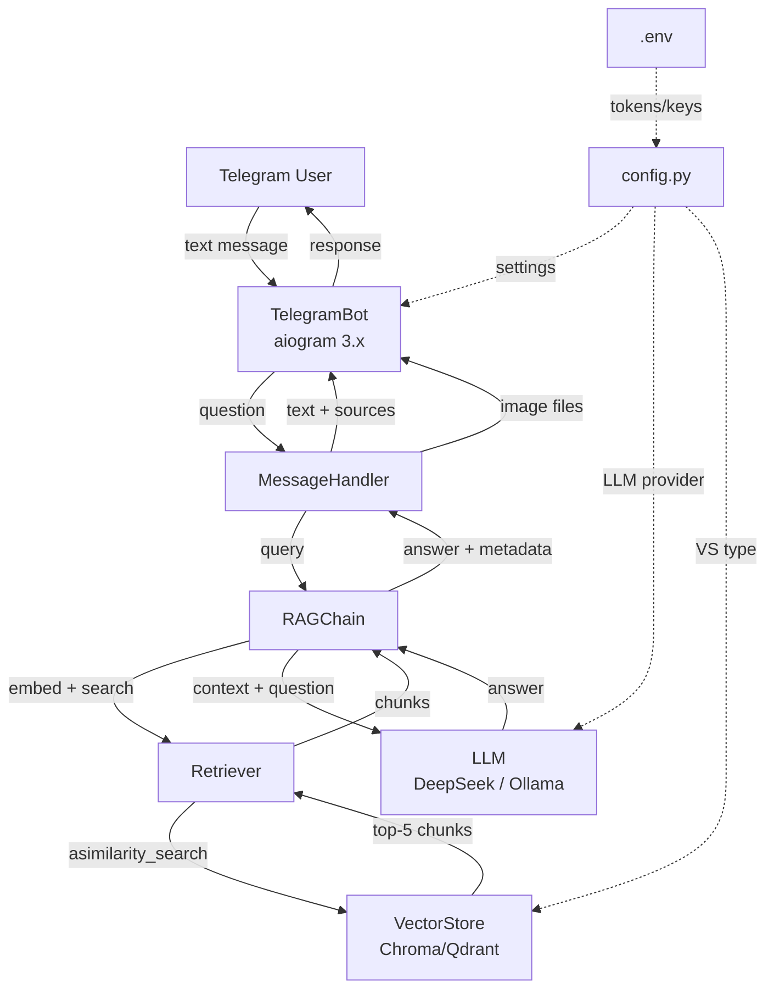
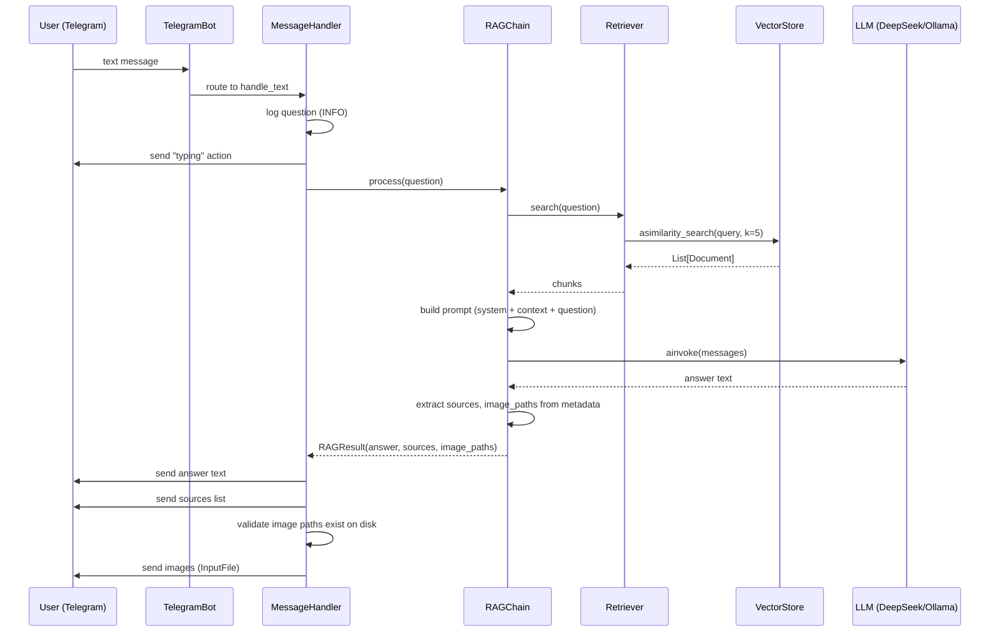

# Design Document: Telegram RAG Bot

## Overview

Telegram-бот — асинхронный пользовательский интерфейс для RAG-системы. Бот принимает текстовые вопросы, выполняет семантический поиск по векторной БД, генерирует ответ через LLM и возвращает пользователю текст с цитатами из источников и релевантными изображениями.

Ключевые принципы:
- Полностью асинхронная архитектура (asyncio) — aiogram 3.x + LangChain async API
- Модульность — каждый компонент (бот, retriever, LLM, RAG chain) изолирован в отдельном классе
- Переиспользование существующей инфраструктуры — `common/vector_store_factory.py`, `config.py`
- OOP стиль, соответствующий существующим `classes_processing/`

## Architecture



### Структура каталогов

```
classes_bot/
├── __init__.py
├── bot.py              # TelegramBot — запуск/остановка, Dispatcher
├── handlers.py         # MessageHandler — роутер с обработчиками сообщений
├── rag_chain.py        # RAGChain — оркестрация retrieval + generation
├── retriever.py        # Retriever — обёртка над VectorStore.asimilarity_search
└── llm_factory.py      # LLMFactory — создание ChatOpenAI / ChatOllama
```

## Components and Interfaces

### 1. TelegramBot (`classes_bot/bot.py`)

Точка входа для бота. Создаёт aiogram Bot, Dispatcher, подключает роутер с хендлерами.

```python
class TelegramBot:
    def __init__(self, token: str, rag_chain: RAGChain) -> None:
        ...

    async def start(self) -> None:
        # Запускает polling через Dispatcher.start_polling()
        ...

    async def stop(self) -> None:
        # Graceful shutdown
        ...
```

**Зависимости:** aiogram.Bot, aiogram.Dispatcher, MessageHandler, RAGChain

### 2. MessageHandler (`classes_bot/handlers.py`)

Роутер aiogram с обработчиками входящих сообщений. Обрабатывает текстовые сообщения, отклоняет нетекстовые.

```python
class MessageHandler:
    def __init__(self, rag_chain: RAGChain) -> None:
        self.router = Router()
        ...

    async def handle_text(self, message: Message) -> None:
        # 1. Логирует вопрос
        # 2. Отправляет "typing" action
        # 3. Вызывает rag_chain.process(question)
        # 4. Отправляет ответ + цитаты + изображения
        ...

    async def handle_unsupported(self, message: Message) -> None:
        # Отвечает что поддерживаются только текстовые вопросы
        ...
```

**Зависимости:** aiogram.Router, aiogram.types.Message, RAGChain

### 3. RAGChain (`classes_bot/rag_chain.py`)

Оркестратор RAG-пайплайна. Координирует retrieval и generation, формирует финальный ответ.

```python
@dataclass
class RAGResult:
    answer: str
    sources: list[str]        # unique PDF paths from chunk metadata
    image_paths: list[str]    # paths to images from chunk metadata


class RAGChain:
    def __init__(self, retriever: Retriever, llm: BaseChatModel) -> None:
        ...

    async def process(self, question: str) -> RAGResult:
        # 1. Retriever.search(question) -> chunks
        # 2. Если chunks пустой — вернуть "не найдено"
        # 3. Сформировать prompt с контекстом
        # 4. LLM.ainvoke(messages) -> answer
        # 5. Извлечь sources и image_paths из metadata
        # 6. Вернуть RAGResult
        ...
```

**Системный промпт LLM:**
```
Ты — ассистент, отвечающий на вопросы по научным статьям.
Отвечай ТОЛЬКО на основе предоставленного контекста.
Если информации недостаточно, скажи об этом.
Отвечай на том же языке, на котором задан вопрос.
```

**Зависимости:** Retriever, BaseChatModel (LangChain), dataclasses

### 4. Retriever (`classes_bot/retriever.py`)

Обёртка над LangChain VectorStore для асинхронного поиска.

```python
class Retriever:
    def __init__(self, vector_store: VectorStore, top_k: int = 5) -> None:
        ...

    async def search(self, query: str) -> list[Document]:
        # Вызывает vector_store.asimilarity_search(query, k=self._top_k)
        # Возвращает список Document с metadata
        ...
```

**Зависимости:** langchain_core.vectorstores.VectorStore, langchain_core.documents.Document

### 5. LLMFactory (`classes_bot/llm_factory.py`)

Фабрика для создания LLM-клиента на основе конфигурации.

```python
class LLMFactory:
    @staticmethod
    def create() -> BaseChatModel:
        if LLM_PROVIDER == "deepseek":
            return ChatOpenAI(
                model="deepseek-v4-flash",
                api_key=DEEPSEEK_API_KEY,
                base_url="https://api.deepseek.com/v1",
            )
        elif LLM_PROVIDER == "ollama":
            return ChatOllama(
                model="qwen2.5:7b",
                base_url=OLLAMA_BASE_URL,
            )
        else:
            raise ValueError(...)
```

**Зависимости:** langchain_openai.ChatOpenAI, langchain_ollama.ChatOllama, config

## Data Models

### Chunk Metadata (существующая структура в VectorStore)

```python
# Document.metadata — dict, содержит:
{
    "source": "source/pdf/01_arctic_gold_2017.pdf",   # путь к PDF
    "image_paths": ["source/md/img/image_000001_....png", ...]  # пути к изображениям
}
```

### RAGResult (новая структура)

```python
@dataclass
class RAGResult:
    answer: str              # Сгенерированный ответ LLM
    sources: list[str]       # Уникальные пути к PDF из metadata (дедупликация)
    image_paths: list[str]   # Все пути к изображениям из metadata chunks
```

### Расширение config.py

```python
# --- Telegram Bot ---
from dotenv import load_dotenv
load_dotenv()

TELEGRAM_BOT_TOKEN: str = os.environ.get("TELEGRAM_BOT_TOKEN", "")

# --- LLM ---
LLM_PROVIDER: str = "deepseek"  # "deepseek" | "ollama"
DEEPSEEK_API_KEY: str = os.environ.get("DEEPSEEK_API_KEY", "")
DEEPSEEK_MODEL: str = "deepseek-v4-flash"
DEEPSEEK_BASE_URL: str = "https://api.deepseek.com/v1"

OLLAMA_BASE_URL: str = "http://localhost:11434"
OLLAMA_MODEL: str = "qwen2.5:7b"

# --- RAG ---
RAG_TOP_K: int = 5
```

## Data Flow



### Формат ответа пользователю

```
{answer_text}

📚 Источники:
1. 01_arctic_gold_2017.pdf
2. 02_world_gold_1999.pdf

[изображения отправляются отдельными сообщениями]
```


## Correctness Properties

*A property is a characteristic or behavior that should hold true across all valid executions of a system — essentially, a formal statement about what the system should do. Properties serve as the bridge between human-readable specifications and machine-verifiable correctness guarantees.*

### Property 1: Prompt contains all context and question

*For any* list of retrieved chunks and any user question, the prompt passed to the LLM SHALL contain the page_content of every chunk in the list and the original user question text.

**Validates: Requirements 3.1**

### Property 2: Source citation deduplication and formatting

*For any* set of chunks with source metadata, the formatted source citation output SHALL contain exactly the set of unique source values (deduplicated), presented as a numbered list, with each unique source appearing exactly once.

**Validates: Requirements 4.1, 4.2, 4.3**

### Property 3: Image paths extraction completeness

*For any* set of chunks with image_paths metadata, the RAGResult SHALL contain all image paths from all chunks' metadata, and the bot SHALL attempt to send every path that exists on disk.

**Validates: Requirements 5.1**

### Property 4: Sequential per-user message processing

*For any* sequence of messages from the same user arriving while a previous message is being processed, the messages SHALL be processed in FIFO order without interleaving their RAG pipeline executions.

**Validates: Requirements 1.2**

## Error Handling

### Стратегия

Трёхуровневая обработка ошибок с graceful degradation:

| Уровень | Компонент | Ошибка | Действие |
|---------|-----------|--------|----------|
| 1 | Retriever | VectorStore недоступен | Сообщить пользователю о временной ошибке, залогировать ERROR |
| 2 | RAGChain | LLM API error / timeout | Сообщить пользователю о невозможности сгенерировать ответ, залогировать ERROR |
| 3 | MessageHandler | Любое необработанное исключение | Generic error message пользователю, залогировать ERROR с traceback |
| — | MessageHandler | Файл изображения не найден | Залогировать WARNING, пропустить изображение, продолжить отправку ответа |

### Реализация

```python
# В MessageHandler.handle_text:
async def handle_text(self, message: Message) -> None:
    try:
        result = await self._rag_chain.process(message.text)
        await self._send_response(message, result)
    except VectorStoreError as e:
        logger.error("Vector store error for user %s: %s", message.from_user.id, e)
        await message.answer("⚠️ Произошла временная ошибка сервиса. Попробуйте позже.")
    except LLMError as e:
        logger.error("LLM error for user %s: %s", message.from_user.id, e)
        await message.answer("⚠️ Не удалось сгенерировать ответ. Попробуйте позже.")
    except Exception:
        logger.exception("Unexpected error processing message from user %s", message.from_user.id)
        await message.answer("⚠️ Произошла непредвиденная ошибка. Попробуйте позже.")
```

### Кастомные исключения

```python
# classes_bot/exceptions.py
class BotError(Exception): ...
class VectorStoreError(BotError): ...
class LLMError(BotError): ...
```

### Таймауты

- LLM API timeout: 60 секунд (настраивается через config)
- VectorStore timeout: определяется клиентом (Chroma/Qdrant)

### Валидация при запуске

- Проверка наличия `TELEGRAM_BOT_TOKEN` — если отсутствует, `sys.exit(1)` с логом ERROR
- Проверка наличия `DEEPSEEK_API_KEY` (если provider = "deepseek") — если отсутствует, `sys.exit(1)` с логом ERROR

## Testing Strategy

### Подход

Проект использует ручную верификацию (согласно project constitution — «Без тестов — проект верифицируется вручную»). Однако для core-логики RAG chain предусмотрена возможность автоматической проверки.

### Property-Based Testing

Библиотека: **Hypothesis** (Python)

Каждый property-тест запускается минимум 100 итераций. Тесты используют моки для VectorStore и LLM.

**Конфигурация:**
```python
from hypothesis import given, settings, strategies as st

@settings(max_examples=100)
```

**Теги:** Каждый тест аннотирован комментарием:
```python
# Feature: telegram-rag-bot, Property 1: Prompt contains all context and question
```

### Что тестировать property-based:
1. **RAGChain.process** — формирование промпта (Property 1)
2. **Форматирование source citations** — дедупликация и нумерация (Property 2)
3. **Извлечение image_paths из metadata** — полнота (Property 3)
4. **Очередь сообщений** — FIFO порядок (Property 4)

### Что тестировать example-based (unit):
- Обработка нетекстовых сообщений → сообщение об ошибке
- Пустой результат поиска → сообщение "не найдено"
- LLM factory: deepseek → ChatOpenAI, ollama → ChatOllama
- Отсутствие токена → exit(1)
- Graceful shutdown по SIGINT/SIGTERM

### Что тестировать integration:
- Полный цикл: вопрос → retrieval → LLM → ответ (с мок-VectorStore и мок-LLM)
- Проверка работы с реальным VectorStore (Chroma) в dev-окружении

### Зависимости для тестов (опционально, в dev extras)

```toml
[project.optional-dependencies]
dev = ["pytest", "pytest-asyncio", "hypothesis"]
```
