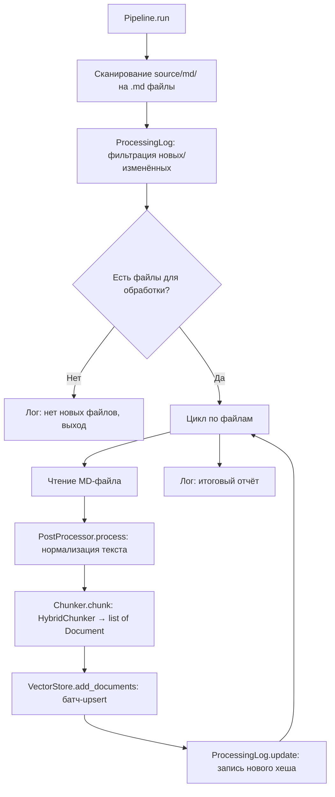

# Design Document: Text Processing Pipeline

## Overview

Пайплайн обработки текста реализуется как набор Python-модулей в ООП-стиле, максимально используя экосистему LangChain. Полный цикл: пост-обработка → чанкинг → сохранение в векторную БД (эмбеддинги генерируются самим vector store при вызове `add_documents`).

Компоненты:
- **PostProcessor** (custom) — нормализация текста через `ftfy` + `re`
- **Chunker** — обёртка над `HybridChunker` из `docling.chunking`, возвращает LangChain `Document` объекты
- **Vector Store** — `Chroma` из `langchain-chroma` или `QdrantVectorStore` из `langchain-qdrant`, выбор через factory-функцию в `config.py`
- **Embeddings** — `HuggingFaceEmbeddings` из `langchain-huggingface` (модель `intfloat/multilingual-e5-large`)
- **ProcessingLog** (custom) — JSON-файл с MD5-хешами для инкрементальной обработки
- **Pipeline** (custom) — оркестратор, связывает компоненты

Кастомного ABC для vector store нет — используется LangChain `VectorStore` базовый класс напрямую. Переключение между Chroma и Qdrant через factory-функцию `create_vector_store()`.

## Architecture



### Архитектурные решения

1. **LangChain-native** — vector store и embeddings используются через LangChain-интерфейсы. `Chroma` и `QdrantVectorStore` уже реализуют `VectorStore` из `langchain_core`. При вызове `add_documents` эмбеддинги генерируются автоматически через переданный `embedding_function`.
2. **Нет кастомного ABC** — LangChain `VectorStore` уже является абстракцией. Factory-функция `create_vector_store()` создаёт нужную реализацию по значению в `config.py`.
3. **Нет отдельного Embedder-класса** — `HuggingFaceEmbeddings` передаётся в vector store при создании. Отдельный вызов `embed` не нужен.
4. **LangChain Document** — единый формат передачи данных между компонентами. Chunker возвращает `list[Document]`, vector store принимает `list[Document]`.
5. **Синхронный пайплайн** — для нескольких десятков документов параллелизм не требуется.
6. **Батчевая обработка** — `add_documents` вызывается батчами (размер конфигурируется) для оптимизации I/O.
7. **Инкрементальность по MD5-хешу** — ProcessingLog отслеживает изменения.
8. **Fail-per-file** — ошибка одного документа не останавливает пайплайн.

## Components and Interfaces

### Компонент 1: Pipeline (оркестратор)

**Файл:** `pipeline.py`

```python
from langchain_core.vectorstores import VectorStore

class Pipeline:
    def __init__(self, vector_store: VectorStore):
        self._vector_store = vector_store
        self._post_processor = PostProcessor()
        self._chunker = Chunker()
        self._log = ProcessingLog(PROCESSING_LOG_PATH)

    def run(self) -> None:
        ...
```

- Получает `VectorStore` (LangChain) через конструктор
- Сканирует `SOURCE_MD_DIR` для `.md` файлов
- Фильтрует через `ProcessingLog`
- Для каждого нового/изменённого файла: post-process → chunk → add_documents
- Обновляет `ProcessingLog` после успешной обработки
- Логирует прогресс и итоговый отчёт

### Компонент 2: PostProcessor (нормализация текста)

**Файл:** `post_processor.py`

```python
class PostProcessor:
    def process(self, text: str) -> str:
        ...
```

Правила обработки (в порядке применения):
1. `ftfy.fix_text()` — попытка восстановления Unicode
2. Удаление нечитаемых символов (non-printable, mojibake, оставшихся после ftfy)
3. Склейка переносов: паттерн `слово -\nпродолжение` → `словопродолжение` (только когда за дефисом через пробел/перенос идёт строчная буква)
4. Удаление пробелов перед пунктуацией: `г .` → `г.`
5. Замена множественных пробелов на одинарный
6. Схлопывание дублирующихся пустых строк в одну

**Исключения из обработки:**
- Строки таблиц (`|...|`) — пропускаются
- Ссылки на изображения (``) — сохраняются как есть
- Markdown-заголовки (`##`) — структура сохраняется
- Реальные составные слова с дефисом (`золото-добывающей`) — не затрагиваются

**Зависимости:** `ftfy`, `re` (stdlib)

### Компонент 3: Chunker (разбиение на чанки)

**Файл:** `chunker.py`

```python
from langchain_core.documents import Document
from docling.chunking import HybridChunker

class Chunker:
    def __init__(self, max_tokens: int = 512, tokenizer: str = EMBEDDING_MODEL_NAME):
        self._chunker = HybridChunker(
            tokenizer=tokenizer,
            max_tokens=max_tokens,
        )

    def chunk(self, text: str, md_filename: str) -> list[Document]:
        ...
```

- Использует `HybridChunker` из `docling.chunking` с `max_tokens=512`
- Принимает `tokenizer` (имя модели) для корректного подсчёта токенов
- Возвращает `list[Document]` — LangChain-объекты с `page_content` и `metadata`
- Преобразует имя MD-файла в путь к PDF: `01_arctic_gold_2017.md` → `source/pdf/01_arctic_gold_2017.pdf`
- Извлекает ссылки на изображения из текста (``)
- Присваивает `page_number` если информация доступна

### Компонент 4: Embeddings (через LangChain)

Отдельного класса нет. Используется `HuggingFaceEmbeddings` из `langchain-huggingface`:

```python
from langchain_huggingface import HuggingFaceEmbeddings

embeddings = HuggingFaceEmbeddings(
    model_name=EMBEDDING_MODEL_NAME,  # "intfloat/multilingual-e5-large"
)
```

- Мультиязычная модель — RU/EN/ZH без доп. настроек
- Передаётся в vector store при создании
- Эмбеддинги генерируются автоматически при `add_documents`

### Компонент 5: Vector Store (через LangChain + Factory)

**Файл:** `vector_store_factory.py`

```python
from langchain_core.vectorstores import VectorStore
from langchain_huggingface import HuggingFaceEmbeddings
from langchain_chroma import Chroma
from langchain_qdrant import QdrantVectorStore
from qdrant_client import QdrantClient

def create_vector_store(embeddings: HuggingFaceEmbeddings) -> VectorStore:
    if VECTOR_STORE_TYPE == "chroma":
        return Chroma(
            collection_name=CHROMA_COLLECTION_NAME,
            embedding_function=embeddings,
            persist_directory=CHROMA_PERSIST_DIR,
        )
    elif VECTOR_STORE_TYPE == "qdrant":
        client = QdrantClient(url=QDRANT_URL)
        return QdrantVectorStore(
            client=client,
            collection_name=QDRANT_COLLECTION_NAME,
            embedding=embeddings,
        )
    else:
        raise ValueError("Unknown vector store type: %s" % VECTOR_STORE_TYPE)
```

- Никакого кастомного ABC — `Chroma` и `QdrantVectorStore` уже наследуют LangChain `VectorStore`
- Метод `add_documents(documents: list[Document])` — стандартный LangChain API
- Метод `similarity_search(query: str, k: int)` — для retrieval
- Переключение между реализациями — одна строка в `config.py`

### Компонент 6: ProcessingLog (журнал обработки)

**Файл:** `processing_log.py`

```python
class ProcessingLog:
    def __init__(self, log_path: Path):
        ...

    def is_processed(self, filename: str, content_hash: str) -> bool:
        ...

    def update(self, filename: str, content_hash: str) -> None:
        ...

    @staticmethod
    def compute_hash(content: str) -> str:
        ...
```

- Хранит JSON-файл с маппингом `{filename: md5_hash}`
- `is_processed` возвращает `True` если файл с таким хешем уже обработан
- `update` записывает новую запись и сохраняет на диск
- `compute_hash` вычисляет MD5 от содержимого файла

### Внешние зависимости

| Пакет | Назначение |
|-------|-----------|
| `langchain-huggingface` | `HuggingFaceEmbeddings` — обёртка над sentence-transformers |
| `langchain-chroma` | `Chroma` — LangChain-интеграция для ChromaDB |
| `langchain-qdrant` | `QdrantVectorStore` — LangChain-интеграция для Qdrant |
| `langchain-docling` | Зависимость, подтягивающая `docling.chunking.HybridChunker` |
| `ftfy` | Восстановление Unicode-кодировки |

### Точка входа

**Файл:** `pipeline.py` (функция `main`)

```python
def main() -> None:
    embeddings = HuggingFaceEmbeddings(model_name=EMBEDDING_MODEL_NAME)
    vector_store = create_vector_store(embeddings)
    pipeline = Pipeline(vector_store)
    pipeline.run()
```

## Data Models

### LangChain Document (из langchain_core)

Единый формат данных между компонентами. Не создаём свои dataclass — используем стандартный LangChain `Document`:

```python
from langchain_core.documents import Document

# Пример чанка как Document
doc = Document(
    page_content="Текст чанка...",
    metadata={
        "source": "source/pdf/01_arctic_gold_2017.pdf",
        "image_paths": '["source/md/img/image_001.png"]',  # JSON-строка
        "page_number": 3,
    }
)
```

### Структура метаданных в Document.metadata

| Поле | Тип | Описание |
|------|-----|----------|
| `source` | `str` | Путь к оригинальному PDF-файлу |
| `image_paths` | `str` (JSON) | JSON-массив путей к изображениям |
| `page_number` | `int \| None` | Номер страницы (если доступен) |

Chroma не поддерживает списки в метаданных, поэтому `image_paths` сериализуется в JSON-строку.

### Модель журнала обработки (processing_log.json)

```json
{
  "01_arctic_gold_2017.md": "a1b2c3d4e5f6...",
  "02_world_gold_1999.md": "f6e5d4c3b2a1..."
}
```

Формат: `{filename: md5_hex_digest}`. Файл перезаписывается целиком при каждом обновлении.

### Модель статистики выполнения

```python
@dataclass
class PipelineStats:
    total_found: int = 0
    skipped: int = 0
    processed: int = 0
    failed: int = 0
    total_chunks: int = 0
    errors: list[str] = field(default_factory=list)
```

### Расширение config.py

```python
# --- Text Processing Pipeline ---
SOURCE_MD_DIR = Path("source/md")
SOURCE_PDF_DIR = Path("source/pdf")
PROCESSING_LOG_PATH = Path("processing_log.json")

# Embedding
EMBEDDING_MODEL_NAME = "intfloat/multilingual-e5-large"

# Chunking
MAX_CHUNK_TOKENS = 512

# Vector Store
VECTOR_STORE_TYPE = "chroma"  # "chroma" | "qdrant"
CHROMA_PERSIST_DIR = "chroma_db"
CHROMA_COLLECTION_NAME = "documents"

# Qdrant (production)
QDRANT_URL = "http://localhost:6333"
QDRANT_COLLECTION_NAME = "documents"

# Batch settings
UPSERT_BATCH_SIZE = 64
```

## Error Handling

### Стратегия обработки ошибок

Пайплайн следует принципу **"fail per file, continue processing"**:

| Ситуация | Поведение |
|----------|----------|
| `source/md/` не существует | Логирует error, завершается |
| Нет `.md` файлов в директории | Логирует warning, завершается gracefully |
| Все файлы уже обработаны | Логирует info, завершается gracefully |
| Ошибка чтения MD-файла | Логирует error с именем файла, продолжает |
| Ошибка пост-обработки | Логирует error, пропускает файл, продолжает |
| Ошибка чанкинга | Логирует error, пропускает файл, продолжает |
| Модель embeddings недоступна | Логирует error, завершает работу пайплайна |
| Ошибка `add_documents` в Vector Store | Логирует error с именем документа, продолжает |
| Ошибка обновления ProcessingLog | Логирует warning, файл будет переобработан при следующем запуске |

### Примеры лог-сообщений

```
ERROR: Source directory 'source/md' does not exist.
WARNING: No MD files found in 'source/md'.
INFO: No new files require processing. All 2 files are up to date.
INFO: Skipping '01_arctic_gold_2017.md' — already processed.
INFO: Processing '02_world_gold_1999.md' (1/1)...
INFO: Created 15 chunks for '02_world_gold_1999.md'.
ERROR: Failed to add documents to vector store for '03_africa_gold_2023.md': <exception>
ERROR: Embedding model 'intfloat/multilingual-e5-large' not available locally.
INFO: --- Pipeline Summary ---
INFO: Total found: 3, Skipped: 1, Processed: 1, Failed: 1
```
